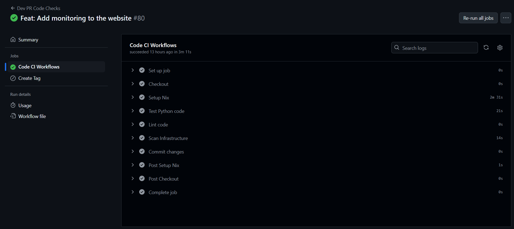
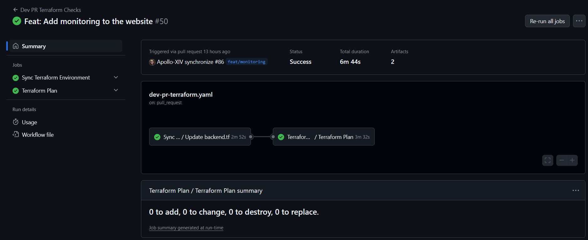
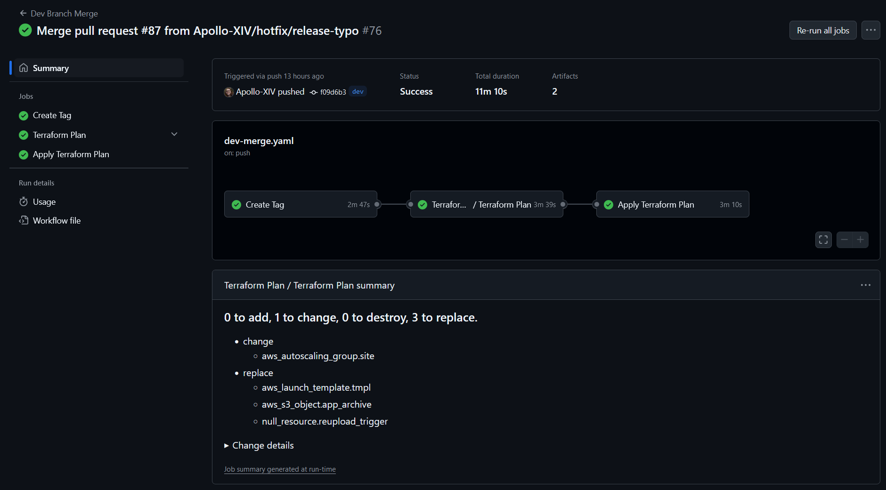
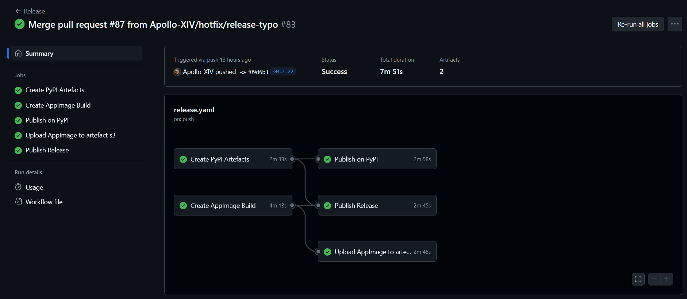

# CI/CD & Pipelines
Automation is used commonly throughout the repo in order to make development more efficient. The following workflows are used:
- Dev-PR-Code: Standard code testing that runs on each commit to a Pull Request Branch. Optionally, an incremental tag is created when a label is added to a PR for test builds and publishing to TestPyPI
  
- Dev-PR-Terraform: Terraform environment syncing and change planning that runs only when changes are made to infrastructure files in the repo
  
- Dev-Merge: Automated tagging, followed by Terraform plan and apply stages. The apply stage is held for approval before running
  
- Release: Automated release process triggered when tags are pushed to the repo (particularly by the merge workflow). This workflow builds the different artefacts for that tag (Python Wheel and tar.gz, and linux AppImage). The artefacts are then published to their respective destinations (PyPI and S3), as well as a release is created in GitHub.
  
