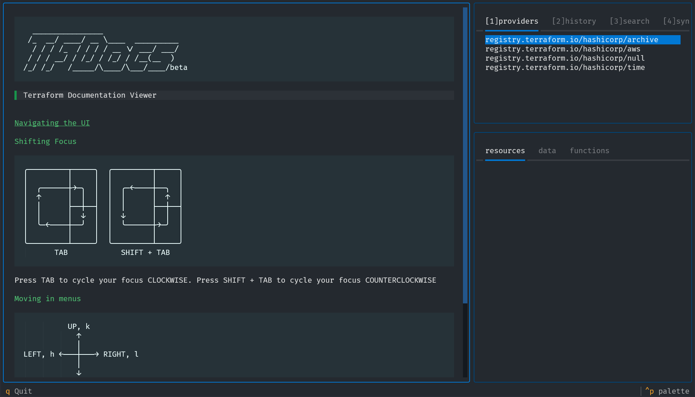
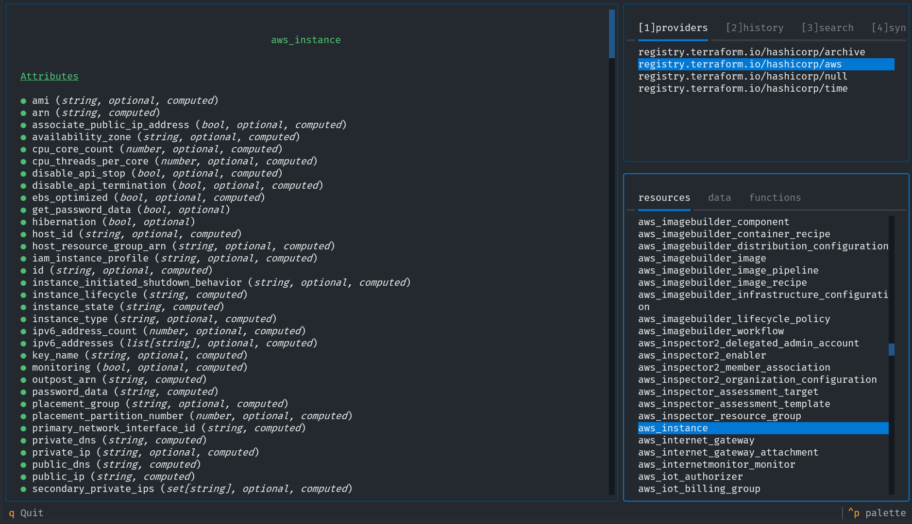

# Interface Design
---
A key part of the user experience is the layout of the sub-commands and their options. A command that is overly-verbose or clunky isn't going to be comfortable to use, and developers (the target user) won't look to it as a tool for daily use.

```
tfdocs <sub-command> [options]
```
## Sub-commands & Options
These are all the sub-commands and options for the tool, with the main command itself being called `tfdocs`.
- `init`: Sub-command that must be run at least once in a working directory in order to generate the local cache
- `watch-logs`: View any logs sent by the program (the main program must be run with `--serve-logs`)


### `init`
Configures the tool for use if being run for the first time, and then loads any Terraform schemas from the local directory into the database. 
#### Procedure:
The init process does the following steps:
1. Check if there is an existing database
  - if there is, ask the user whether they'd like to delete the existing database and replace it
  - if the user confirms, delete and continue
  - otherwise, error and stop execution
2. Create a new sqlite3 database and the necessary tables
3. Sync the database with the local terraform config (`tfdocs/db/sync.py`)

### Global Arguments
- `--verbose`: Allows the user to increase verbosity
- `--serve-logs`: Sends any logs generated by the program while in the GUI to the local log server (accessed using the `watch-logs` subcommand)
- `--help`: View help information

#### Top-level Specific Arguments
- `--provider PROVIDER`: Open the GUI directly to a specified provider

## GUI


