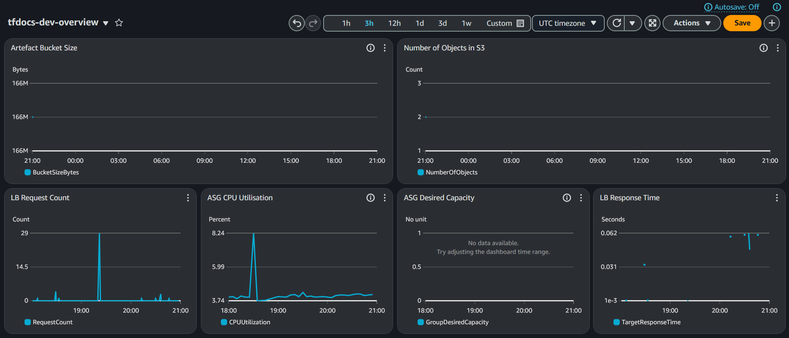

# Infrastructure
The majority of the infrastructure is to specifically support the website. 

The website is hosted on an autoscaling group behind a load-balancer. As part of the deployment method, a private S3 bucket is used to upload the source-code. There is also a public S3 bucket that hosts the downloads for each available version.

### Deployment
In order to deploy the website the source code needs to be uploaded to the servers. Typically you might use SSH to do this, however, that presents security risks and requires a bastion host as the nodes are in a private subnet. In solution to this, the source code is zipped by terraform, then uploaded to a private s3 bucket. The autoscaling group nodes are then configured using user data scripts to pull the source code zip and begin running it. The terraform has been configured so that any changes to the source archive causes the launch template to update and the ASG to begin a rolling update.

The autoscaling group is configured to scale up and down based on the average CPU utilisation of the instances.

## Monitoring
Monitoring is configured using CloudWatch.

The dashboard collects a range of different information from the S3 buckets, Load Balancer, and Autoscaling Group. This allows me to get a top-level overview of my infrastructure and spot any possible errors or issues happening. I've also configured monitoring alarms for low and high CPU Utilisation across the ASG.
