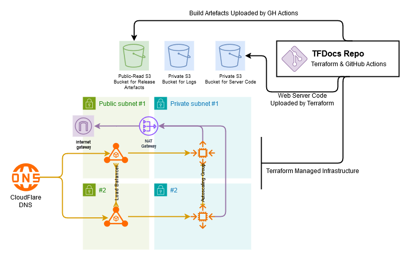

# Infrastructure
The majority of the infrastructure is to specifically support the website. The website is hosted on an autoscaling group behind a load-balancer. As part of the deployment method, a private S3 bucket is used to upload the source-code. There is also a public S3 bucket that hosts the downloads for each available version.

