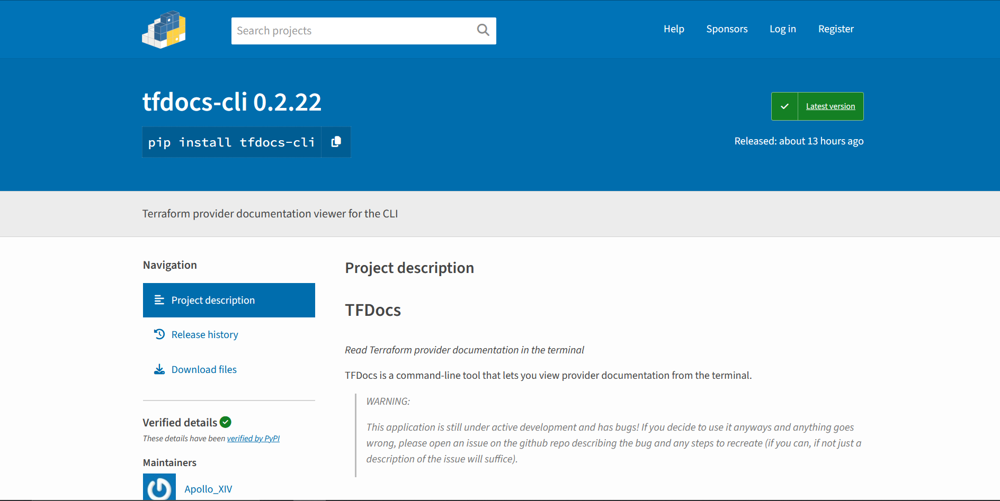

# Publishing & Software Distribution
There are two main ways to distribute software:
- Through a package manager, such as *'apt'*, *'rpm'*, or *'dnf'*, comparable to an app store on mobile devices.
- Through a standalone executable that user's install manually

Given the time-frame and limitations of the project, I wanted to use a solution that offered the most platforms being supported without a disproportionate amount of work. Python is a famously difficult language to distribute, and there have been a number of different solutions across Python's history. 

The easiest method, and one I could achieve relatively quickly, was by publishing my software to the Python Package Index (aka PyPI). This involves making sure that the package is formatted properly with an appropriate entrypoint (`__main__.py`), creating workflows and scripts to build the distributables, and then using a GitHub Action to publish to PyPI. I used OIDC to authenticate my workflows, which allows for secure, key-less publishing.

The second - slightly more difficult - method is to create a standalone executable. To explain, we need to make a brief tangent into the different types of executable that a computer can run. For the most part, we can divide them into two categories:
- Static Executables
- Dynamically Linked Executables, or simply 'Dynamic Executables'

You might also see these referred to as binaries as opposed to executables. A static executable is completely standalone, with all the dependencies needed to run included in the file. A dynamically linked executable expects certain files and libraries to exist on the device running it. Most commonly, this is used to avoid having to include 'Glibc' libraries inside every executable, as for the most part it can be assumed that the destination device will have a copy. However, a binary cannot assume *where* that library is located on the system. This mostly differs by distribution on platforms like Linux, meaning that if you're building a dynamically linked executable, a copy must be built on each platform you wish to support, and for Linux, on each distribution. With that explained, **tangent over**.

### Building an Executable
Initially, I was keen to build a static executable and hopefully side-step the issue entirely. This turned out to be more difficult than just making platform-specific distributables. So, I pivoted to making a dynamically linked executable using docker as a virtualisation environment. This work seemed promising, and you can see some of the progress in the `build-containers` directory. Though, it didn't take long to realise that if I used this method I likely wouldn't finish it in time for the project deadline. So, in my final pivot I investigated using my package manager, *'Nix'*, to create an AppImage.

> What is an AppImage
>
> An AppImage on Linux is a portable software package that bundles an application and all its dependencies into a single executable file. It allows users to run software on any compatible Linux distribution without installation or root permissions. AppImages are self-contained, leaving no traces on the system since they don’t modify configurations or require installation of additional libraries. Users simply download the file, make it executable, and run it, providing a convenient, distribution-agnostic way to use applications.

Nix is a complicated piece of software, but equally potent. Instead of installing packages into a single directory, Nix uses paths hashed on the binaries themselves, allowing for multiple versions of the same package to be installed on a single system. These directories are then linked together using symlinks to create a mesh of package dependencies on the system. There are a number of benefits to this system, but for the current application the most useful one is that for any package we can identify exactly what dependencies it relies upon across the entire system. Taking advantage of this function, multiple people have created 'bundlers' that analyse the dependencies of a Nix package and can roll them all into a single AppImage that doesn't even need Nix installed on the destination system. The caveat is that the resultant filesize can be rather large (~76MB). In my case though, I was willing to accept this trade-off for the convenience of a dependency-less installation.

#### Future Improvements
In the future, I'd definitely like to strive for a static executable. The easiest way to do this is to use a language more suited to doing so. Python was never intended to be used like this in its original design, and this issue I'm facing is a sign that my choice of language doesn't 100% match the application I'm building. Strong contenders for languages to use instead are Rust (a language I'm personally fond of) and Go (very popular in both the DevOps field and for command-line applications).

## Creating Github Releases

