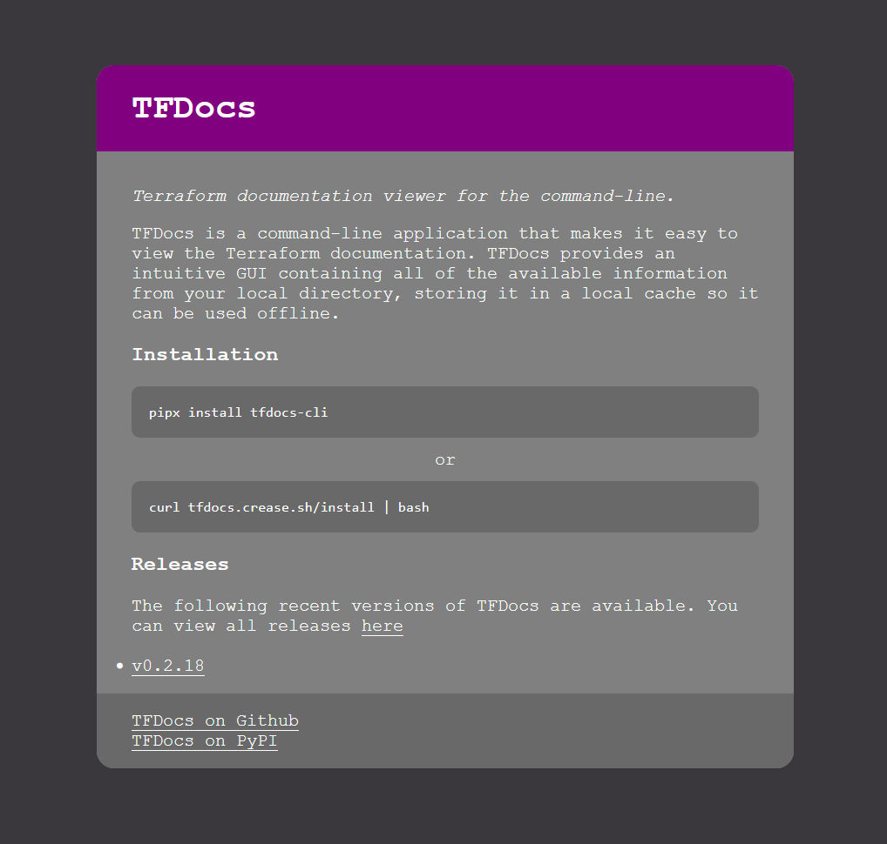
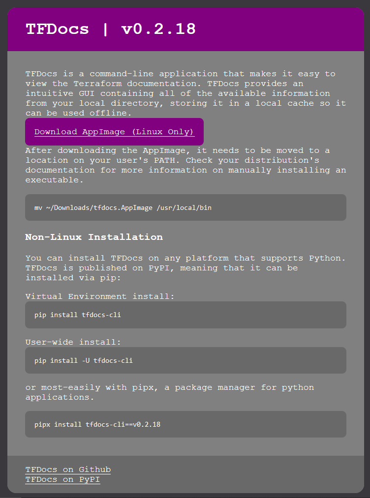

# TFDocs Website
The website is necessary to act as a distribution platform for the software. It also acts as a way to provide a consistent download link I can control for the latest version of the software. This is used by the installation script, which it also serves.

It also allows me to provide some more detailed installation instructions for the user.

